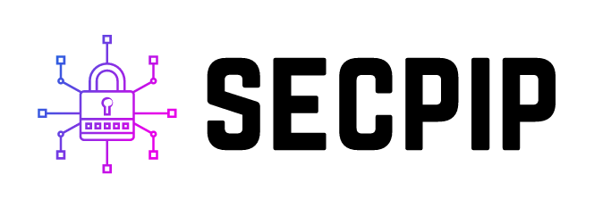

<!-- PROJECT SHIELDS -->
<!--
*** I'm using markdown "reference style" links for readability.
*** Reference links are enclosed in brackets [ ] instead of parentheses ( ).
*** See the bottom of this document for the declaration of the reference variables
*** for contributors-url, forks-url, etc. This is an optional, concise syntax you may use.
*** https://www.markdownguide.org/basic-syntax/#reference-style-links
-->
[![Pypi Downloads][downloads-badge]](https://pypi.org/project/secpip/)
[![Contributors][contributors-shield]][contributors-url]
[![Forks][forks-shield]][forks-url]
[![Stargazers][stars-shield]][stars-url]
[![Issues][issues-shield]][issues-url]
[![MIT License][license-shield]][license-url]
[![LinkedIn][linkedin-shield]][linkedin-url]


<!-- PROJECT LOGO -->  
<br />  
<p align="center">  
  <a href="https://github.com/myasinsaglam/secpip">
    
  </a>

  <h3 align="center">Secpip - Secure Pip Package Management Tool </h3>
  <p align="center">  
    Secpip is command line interface to manage (install, download, uninstall, migrate) python libraries securely. 
    <br />  
    <a href="https://github.com/myasinsaglam/secpip"><strong>Explore the docs »</strong></a>  
    <br />  
    <br />  
    <a href="https://github.com/myasinsaglam/secpip">View Demo</a>  
    ·  
    <a href="https://github.com/myasinsaglam/secpip/issues">Report Bug</a>  
    ·  
    <a href="https://github.com/myasinsaglam/secpip/issues">Request Feature</a>  
  </p>  
</p>  
  
  
<!-- TABLE OF CONTENTS -->  
## Table of Contents  
  
* [About the Project](#about-the-project)  
* [Getting Started](#getting-started)  
  * [Prerequisites](#prerequisites)  
  * [Installation](#installation)  
* [Usage](#usage)  
* [Roadmap](#roadmap)  
* [Contributing](#contributing)  
* [License](#license)  
* [Contact](#contact)  
* [Acknowledgements](#acknowledgements)  
  
  
  
  
<!-- ABOUT THE PROJECT -->  
## About The Project  
  
  
Secpip is command line interface to manage pip packages in secure way.  
Secpip controls the given package version has known vulnerability or not according to vulnerability database published as [safety-db](https://github.com/pyupio/safety-db).   
If given package has vulnerability, Secpip tries to find available secure versions of package.  
After secure version of package found, it automatically install the secure package (if '--secure' and '--auto' tags are used).  
  
Abilities of Secpip  
  
- Package vulnerability check and extraction from virtual environments.  
  
- Downloads pip packages(secure) if offline installation needed to another environments or nodes.  
  
- You can install libraries as online and offline to virtual environments by using Secpip easily.   
  
- It is based on pip(wraps pip commands) so you need to install pip.  
  
- It checks python package security conditions by using safety library according to published vulnerabilities.  
  
- It create a report the result of operation.  
  
- It create/build/dump python virtual environments.  
  
- It uninstall multiple packages from virtual environment with one command by taking requirements file.  
  
- It migrate virtual environment to another one or new one securely.  
  
  
  
  
<!-- GETTING STARTED -->  
## Getting Started  
  
Definitions and examples about installation and usage of Secpip modules.  
You can follow these steps to install and use Secpip.  
  
### Prerequisites  
  
- python3  
- pip   
- virtualenv : A tool for creating isolated virtual python environments.   
  
  
### Installation  

- #### Firstly Install python 3 and pip.  

#### Install From Repo

  1. Clone the repo  
  ```shell  
  git clone https://github.com/myasinsaglam/secpip.git
  ```  
  
  2. Install Requirements from requirements.txt  
  ```shell  
  pip install -r requirements.txt
  ```  
  3. Install Secpip
  
  In project directory run
  ```shell
  pip install .
  ```
  or
  ```shell
  python setup.py install
  ```

#### Install via pip
  ```shell
  pip install secpip
  ```

<!-- USAGE EXAMPLES -->  
## Usage:
Entrypoints and example commands explained here.
### Entrypoint
```text
usage: secpip <command> [<args>]
Commands:
  install               Install pip packages by using secpip abilities (secure, report, auto_mode)
  dump                  Package/Download pip packages by using secpip abilities (secure, report, auto_mode)
  uninstall             Uninstall pip packages from venv as single or batch from requirements
  migrate               Migrate virtual environment to another one securely
  sync                  Synchronize Database from web
General Options:
  --secure              Secure option to check known vulnerabilities. If package is not secure operation not allowed to package
  --auto                Use with secure option. It replace vulnerable package with next secure version, If no secure package exists it create warning and install insecure one.      

Secure pip package manager...

positional arguments:
  command     {install, dump, uninstall}

optional arguments:
  -h, --help  show this help message and exit

```


### Install 

Install command description and arguments

```text  
  
usage: secpip install [-h] [--secure] [--auto] [--report REPORT_DIR]
              [-v ENVIRONMENT_DIR] [-p PACKAGE_DIR] [-r REQUIREMENTS_DIR]

Install pip packages as online or offline with security check

optional arguments:
  -h, --help            show this help message and exit
  --secure              A flag for security check option
  --auto                A flag for auto correct versions by replacing secure
                        one
  --report REPORT_DIR   Report Extraction Option
  -v ENVIRONMENT_DIR, --venv_dir ENVIRONMENT_DIR
                        Python environment path to install modules
  -p PACKAGE_DIR, --package_dir PACKAGE_DIR
                        Downloaded package directory for offline install
  -r REQUIREMENTS_DIR, --requirements_file REQUIREMENTS_DIR
                        Requirements txt i/o file path, default is
                        {current_path}/requirements.txt

```

####Examples
- #####Optional flags

  [--secure] - security check if package not secure, operation is not allowed on vulnerable package
  
  [--auto] - auto replace with secure version
  
  [--report] report filename - writes operation report to given file. 


- ##### Online single package install to virtual environment(optional - if not it installs current python environment) 

```shell
secpip install [package name] -v [venv dir] --secure --auto
```

- ##### Offline single package install from package directory to virtual environment(optional - if not it installs current python environment) 

```shell
secpip install [package name] -v [venv dir] -p [downloaded package directory] --secure --auto
```

- ##### Online install packages from requirements file to virtual environment
```shell
secpip install -r [requirements path] -v [venv dir] --secure --auto  --report [report filename]
```

- ##### Offline install requirements file packages from package directory to virtual environment(optional - if not it installs current python environment) 
```shell
secpip install -r [requirements path] -v [venv dir] -p [downloaded package directory] --secure --auto
```


### Dump
Dump command description and arguments
```text
usage: secpip dump [-h] [--secure] [--auto] [--report REPORT_DIR]
              [-v ENVIRONMENT_DIR] [-p PACKAGE_DIR] [-r REQUIREMENTS_DIR]

Dump pip packages:
            - from package name to to directory as setup file
            - from requirements to directory as setup files
            - from venv to directory as setup files
            - from venv to requirements as metadata

optional arguments:
  -h, --help            show this help message and exit
  --secure              A flag for security check option
  --auto                A flag for auto correct versions
  --report REPORT_DIR   Report Extraction Option
  -v ENVIRONMENT_DIR, --venv_dir ENVIRONMENT_DIR
                        Python environment path to extract installed modules
  -p PACKAGE_DIR, --package_dir PACKAGE_DIR
                        Downloaded package directory for offline install
  -r REQUIREMENTS_DIR, --requirements_file REQUIREMENTS_DIR
                        Requirements txt i/o file path, default is
                        {current_path}/requirements.txt
```
####Examples

- #####Optional flags

  [--secure] - security check if package not secure, operation is not allowed on vulnerable package
  
  [--auto] - auto replace with secure version
  
  [--report] report filename - writes operation report to given file. 


- ##### Single package download to directory

```shell
secpip dump [package name] -p [directory to download] --secure --auto
```

- ##### Download packages from virtual environment to directory 
```shell
secpip dump -v [venv dir] -p [downloaded package directory] --secure --auto
```

- ##### Download packages from requirements file to directory 
```shell
secpip dump -r [requirements path] -p [downloaded package directory] --secure --auto
```


### Uninstall
Dump command description and arguments. This command just added to uninstall multiple packages. :)
- Multiple packages can be uninstall from environment by using requirements file argument.
```text

usage: secpip uninstall [-h] [-venv ENVIRONMENT_DIR] [-r REQUIREMENTS_DIR]

Uninstall pip packages as batch by using requirement file

optional arguments:
  -h, --help            show this help message and exit
  -v ENVIRONMENT_DIR, --venv_dir ENVIRONMENT_DIR
                        Python environment path that will be uninstall modules
                        from
  -r REQUIREMENTS_DIR, --requirements_file REQUIREMENTS_DIR
                        Requirements txt i/o file path, default is
                        {current_path}/requirements.txt
```
####Examples
- #####Optional flags
  [-v], [--venv_dir] - Environment directory is optional if not given it uses currently active python environment.


- ##### Single package uninstall from environment

```shell
secpip uninstall [package name] -v [venv dir] --secure --auto
```

- ##### Multiple package uninstall from environment
```shell
secpip uninstall -r [requirements path] -v [venv dir] --secure --auto
```

### Migrate
Migrate command description and arguments

```text

usage: secpip migrate [-h] [--secure] [--auto] [--report REPORT_DIR] -s SRC_VENV -d
              DST_VENV

Migrate virtual environment to another virtual environment

optional arguments:
  -h, --help            show this help message and exit
  --secure              A flag for security check option
  --auto                A flag for auto correct versions
  --report REPORT_DIR   Report Extraction Option
  -s SRC_VENV, --src SRC_VENV
                        Source Python environment path to migrate modules
  -d DST_VENV, --dst DST_VENV
                        Destination Python environment path to migrate modules
```
####Examples
- #####Optional flags

  [--secure] - security check if package not secure, operation is not allowed on vulnerable package
  
  [--auto] - auto replace with secure version
  
  [--report] report filename - writes operation report to given file. 


- ##### Migrate virtual env to another new one securely

```shell
secpip migrate -s [Source Python environment path] -d [Destination Python environment path] --secure --auto
```


### Sync:
Just run command below to sync vulnerability database.
```shell
secpip sync
```
  
  

<!-- ROADMAP -->  
## Roadmap  
  - Improve Windows support -- It can only be installed in virtual environment 
  - Add excluded packages option
  - Collect vulnerabilities from different sources, validate and extend vulnerability database with Ai (apply Nlp techniques on vulnerability sources, source code analysis etc.)
  - Service for vulnerability check

See the [open issues](https://github.com/myasinsaglam/secpip/issues) for a list of proposed features (and known issues).  


<!-- CONTRIBUTING -->
## Contributing

Contributions are what make the open source community such an amazing place to be learn, inspire, and create. Any contributions you make are **greatly appreciated**.

1. Fork the Project
2. Create your Feature Branch (`git checkout -b feature/AmazingFeature`)
3. Commit your Changes (`git commit -m 'Add some AmazingFeature'`)
4. Push to the Branch (`git push origin feature/AmazingFeature`)
5. Open a Pull Request


<!-- LICENSE -->
## License

Distributed under the MIT License. See `LICENSE` for more information.


<!-- CONTACT -->
## Contact

[M.Yasin SAGLAM](https://www.linkedin.com/in/myasinsaglam/?locale=en_US) - myasinsaglam@crypttech.com

Project Link: [https://github.com/myasinsaglam/secpip](https://github.com/myasinsaglam/secpip)


<!-- ACKNOWLEDGEMENTS-->  
## Acknowledgements
* This project was supported by the [CRYPTTECH](https://www.crypttech.com/en/)
* [safety-db](https://github.com/pyupio/safety-db)
* [best-readme-template](https://github.com/othneildrew/Best-README-Template)


<!-- MARKDOWN LINKS & IMAGES -->
<!-- https://www.markdownguide.org/basic-syntax/#reference-style-links -->
[contributors-shield]: https://img.shields.io/github/contributors/myasinsaglam/secpip.svg?style=for-the-badge
[contributors-url]: https://github.com/myasinsaglam/secpip/graphs/contributors
[forks-shield]: https://img.shields.io/github/forks/myasinsaglam/secpip.svg?style=for-the-badge
[forks-url]: https://img.shields.io/github/forks/myasinsaglam/secpip/network/members
[stars-shield]: https://img.shields.io/github/stars/myasinsaglam/secpip.svg?style=for-the-badge
[stars-url]: https://img.shields.io/github/stars/myasinsaglam/secpip/stargazers
[issues-shield]: https://img.shields.io/github/issues/myasinsaglam/secpip.svg?style=for-the-badge
[issues-url]: https://github.com/myasinsaglam/secpip/issues
[license-shield]: https://img.shields.io/github/license/myasinsaglam/secpip.svg?style=for-the-badge
[license-url]: https://github.com/myasinsaglam/secpip/blob/master/LICENSE.md
[linkedin-shield]: https://img.shields.io/badge/-LinkedIn-black.svg?style=for-the-badge&logo=linkedin&colorB=555
[linkedin-url]: https://www.linkedin.com/in/myasinsaglam/?locale=en_US
[downloads-badge]: https://img.shields.io/pypi/dd/secpip?style=for-the-badge
